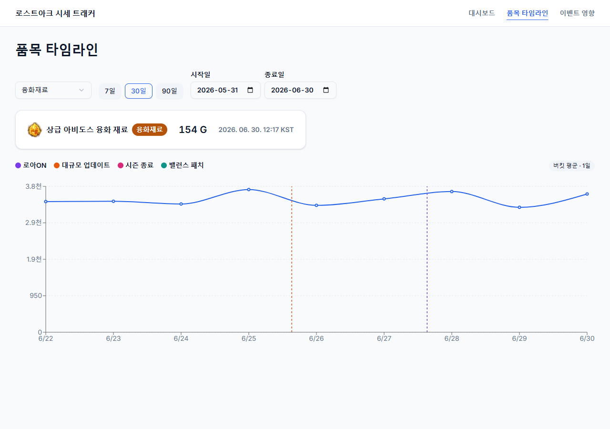
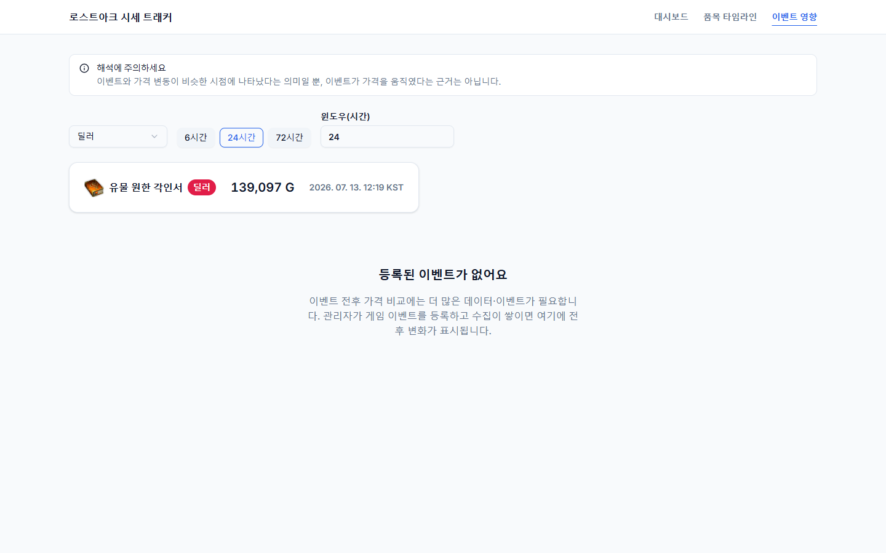
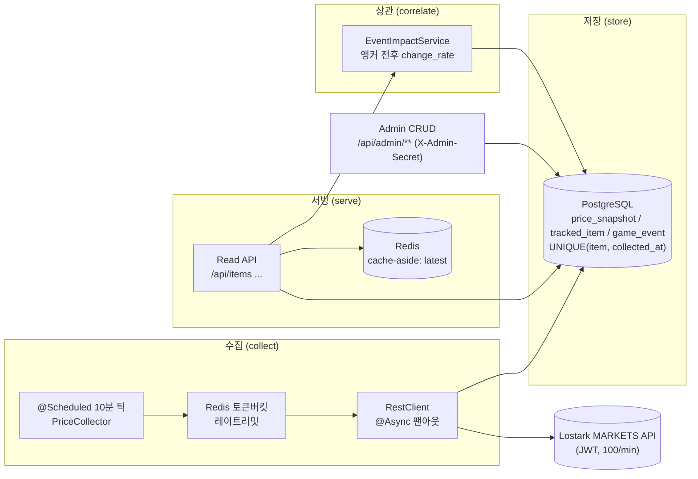

# 🎮 로스트아크 거래소 시세 트래커 (Lostark Market Tracker)

[](https://github.com/jongyeon2/lostark-market-tracker/actions/workflows/ci.yml)


> 레이트리밋이 걸린 **로스트아크 거래소 시세**를 10분마다 빠짐없이 모아 시계열로 쌓고, **게임 이벤트와 가격 변동을 시점 상관**시키는 백엔드 데이터 파이프라인. — 게임이 주제지만, 구조는 **금융 마켓 데이터 파이프라인**과 똑같습니다.


---

## 📖 프로젝트 소개

로스트아크에는 게임 안에서 아이템을 사고파는 **거래소**가 있고, 거기 시세는 하루에도 계속 출렁입니다. 특히 "로아ON(쇼케이스)", "대규모 업데이트", "시즌 종료" 같은 **굵직한 이벤트가 있을 때 특정 아이템 값이 크게 움직인다**는 건 유저라면 누구나 체감하는 사실입니다.

이 프로젝트는 그 시세를 **사람이 들여다보지 않아도 자동으로 10분마다 수집**해 차곡차곡 기록해두고, 나중에 **"언제 어떤 이벤트가 있었고, 그때 가격이 실제로 몇 % 움직였나"** 를 시점 단위로 맞춰 보여줍니다.

**왜 만들었나 —** 저는 로스트아크 유저이자 신입 백엔드 개발자입니다. 좋아하는 게임 도메인을 빌려, **외부 API에서 데이터를 빠짐없이 모아 저장하고 안정적으로 서빙하는 파이프라인**을 직접 설계·구현해 엔지니어링 실력을 "설명 가능하게" 보여주려고 만든 **포트폴리오 프로젝트**입니다. 도메인은 게임이지만, 외부 시장에서 시세를 수집해 시계열로 쌓고 이벤트와 상관시키는 구조는 **주식·코인 같은 금융 마켓 데이터 파이프라인과 동일**합니다.

### 🎯 핵심 가치 — 수집 → 저장 → 서빙 → 상관

> **레이트리밋이 걸린 외부 마켓 API에서 시세를 빠짐없이 수집해 시계열로 쌓고, 캐시로 안정적으로 서빙한다.**

다른 모든 게 실패해도 이 **수집·저장·서빙 파이프라인**은 동작해야 합니다. 그 위에 얹는 헤드라인 기능이 **event-impact**(이벤트 전후 가격 변화율 상관)입니다.

⚠️ **상관 ≠ 인과** — `event-impact`의 변화율은 "이벤트와 가격이 시점상 겹친다(**상관**)"는 뜻이지 "이벤트가 가격을 올렸다(**인과**)"가 아닙니다. 데이터가 희소하거나 오래됐으면 계산하지 않고 `insufficient_data`로 정직하게 응답합니다.

---

## ⭐ 주요 기능

| 기능 | 설명 |
|------|------|
| 🕒 **시세 수집** | `@Scheduled` 10분 틱으로 워치리스트를 Redis 토큰버킷 레이트리밋 아래 `@Async` 병렬 호출 |
| 🗄 **시계열 저장** | `min_price`를 `UNIQUE(tracked_item_id, collected_at)`로 멱등 적재 — 재시작·중복에도 시계열 무결 |
| ⚡ **캐시 서빙** | 최신가는 Redis cache-aside 핫 리드, 타임라인은 큰 범위 자동 다운샘플(시간/일 버킷 평균) |
| 📊 **event-impact (헤드라인)** | 이벤트 전후 앵커 스냅샷으로 `changeRate = post/pre − 1` 계산, 신선도 미달 시 `insufficient_data` |
| 🔐 **관리자 CRUD** | `X-Admin-Secret` 게이트 뒤에서 품목·게임 이벤트 등록/수정/삭제 (시크릿 미설정 시 fail-closed `401`) |
| 🎨 **시각 enrichment** | 품목 아이콘 + 역할 배지(딜러/서포터/융화재료) + CDN 차단에도 안 깨지는 fallback 글리프 |

---

## 🖼 데모

**라이브 데모의 실체는 `dev` 프로파일 실수집입니다** — `.env`의 `LOSTARK_API_KEY`로 로스트아크 거래소 Open API를 실제 호출해 `collection_run`으로 시세를 쌓은 **실데이터**입니다. 공개 배포 URL은 아직 없습니다. 그와 별개로, **API 키 없이 `seed` 모드로 로컬/테스트에서 그대로 재현**할 수 있고(아래 "실행 방법", 합성 8일치 데이터 — 리뷰어 진입장벽 0), 어느 쪽이든 같은 read API를 소비하는 **데스크톱 우선 React 데모(3화면)** 를 띄울 수 있습니다.

| Dashboard | Item Timeline | Event Impact |
|-----------|---------------|--------------|
| 수집 헬스 + 워치리스트 | 시세 라인 차트 + 이벤트 마커 | 이벤트 전후 변화율 |





---

## 🔧 기술 스택

**Backend**
- **언어/프레임워크:** Java 21 · Spring Boot 3.4 · Spring Data JPA · Spring Security
- **저장소:** PostgreSQL 16 (Flyway 마이그레이션) · Redis 7 (cache-aside + 토큰버킷)
- **테스트:** JUnit 5 · Mockito · Testcontainers(Postgres + Redis) — 로컬·CI 동일 메커니즘
- **명시적 제외:** MSA · Kafka · Spring Batch (포트폴리오 범위 집중)

**Frontend** (선택적 데모)
- React 19 · TypeScript 5.7 · Vite 6 · Tailwind CSS v4 · shadcn/ui(radix-ui)
- Recharts(차트) · TanStack Query(서버 상태) · React Router · zod(런타임 스키마 검증) · lucide-react(아이콘)

---

## 💻 실행 방법

**사전 요구:** JDK 21, Docker (Testcontainers/compose용). *(프론트 데모까지 보려면 Node.js)*

### 한눈에 — 3단계 재현 (`seed` · API 키 불필요)

> **`seed` = 로컬/테스트 전용 · 합성 8일치 데이터.** 리뷰어가 API 키 없이 즉시 재현하는 트랙입니다 — '합성'임을 숨기지 않습니다. 라이브 데모의 실체(실수집)는 아래 `dev` 프로파일입니다.

```bash
# 1) 인프라 기동 (Postgres 16 + Redis 7)
cp .env.example .env
docker compose up -d

# 2) seed 프로파일로 앱 실행 — 합성 8일치 시세 + 데모 이벤트를 채움 (LOSTARK_API_KEY 불필요)
./gradlew bootRun --args='--spring.profiles.active=seed'

# 3) 헤드라인 기능 호출 — status "ok" 와 실제 change_rate 가 담긴 events 배열이 반환됨
curl "http://localhost:8080/api/items/1/event-impact?window=24"
```

### 두 가지 실행 프로파일 — `dev`(라이브 실체) vs `seed`(로컬/테스트 합성)

```bash
# (a) dev 프로파일 — 라이브 데모의 실체. 실시간 수집: .env 의 LOSTARK_API_KEY 로 실제 거래소 API 를
#     호출해 collection_run 으로 실데이터를 쌓습니다. bootRun 이 .env 를 자동 로드하므로(build.gradle),
#     .env 에 값을 채우고 아래만 실행하면 됩니다.
./gradlew bootRun --args='--spring.profiles.active=dev'
#     (셸 환경변수가 .env 보다 우선 — 일회성이면 `LOSTARK_API_KEY=<jwt> ./gradlew bootRun ...` 도 가능)

# (b) seed 프로파일 — 로컬/테스트 전용 합성 8일치 시세 + 데모 이벤트. API 키 불필요 (즉시 재현·리뷰용, 합성 데이터)
./gradlew bootRun --args='--spring.profiles.active=seed'
```

- 관리자 콘솔(`/admin`) 로그인·CRUD 를 쓰려면 `.env` 의 `ADMIN_API_SECRET` 에 값을 채우세요 — bootRun 이 이를 앱 JVM 으로 로드해 그 값이 로그인 시크릿이 됩니다. `ADMIN_API_SECRET` 이 비어 있으면 `/api/admin/**` 는 **fail-closed**로 모두 `401` 입니다(공개 읽기 표면과 수집 파이프라인은 정상 동작).
- 빌드 + 전체 테스트: `./gradlew build` (CI가 동일 명령 실행). 로컬 테스트는 Docker 필요, `-PdockerApiVersion=1.44` 권장.

### 프론트 데모 (브라우저)

curl이 아니라 브라우저로 보고 싶다면:

1. **백엔드 기동** — 즉시 재현은 `seed` 프로파일(`--spring.profiles.active=seed`, API 키 불필요·합성), 라이브 실체를 보려면 `dev` 프로파일(`--spring.profiles.active=dev`, `.env`의 `LOSTARK_API_KEY`로 실수집).
2. **프론트 기동** — `cd frontend && npm install && npm run dev` → http://localhost:5173
3. **3화면** — Dashboard(`/`) · Item Timeline(`/timeline`) · Event Impact(`/impact`)

자세한 실행·Vite 프록시 설명·화면별 안내는 [`frontend/README`](frontend/README.md)에 일원화돼 있습니다(단일 진실 원천). **curl로도, 브라우저로도 동일한 read API** 를 보며, 데이터 출처는 프로파일이 정합니다 — `seed`는 합성(로컬/테스트), `dev`는 실수집 실데이터(라이브 실체)입니다.

---
---

> 📦 **이하 — 엔지니어링 상세 (면접관용 깊이)**
> 위까지가 "무엇을·왜"라면, 아래는 "어떻게"입니다. 아키텍처·설계 결정·API 계약·프로젝트 구조를 정직하게 풀어 둡니다.

---

## 🏗 아키텍처



**데이터 흐름 (collect → store → serve → correlate):** `@Scheduled` 수집기가 10분마다 워치리스트를 Redis 토큰버킷 레이트리밋 아래 `@Async`로 병렬 호출해 `min_price`를 `price_snapshot`에 멱등 적재(`UNIQUE(tracked_item_id, collected_at)`)합니다. 읽기 API는 최신가를 Redis cache-aside로 서빙하고 타임라인/다운샘플은 DB 범위 쿼리로 응답합니다. 관리자가 시크릿 게이트 뒤에서 등록한 `game_event`를 스냅샷 시계열과 시점 상관시켜 `event-impact`를 계산합니다.

---

## 🧠 설계 결정 & 트레이드오프 (정직한 "왜")

- **왜 Redis** — (a) 품목별 **최신가 cache-aside** 핫 리드 경로, (b) 스케줄러 **토큰버킷 레이트리밋**. MVP 규모(~12품목)면 DB만으로 읽기를 감당할 수 있음을 인정합니다. "다들 쓰니까"가 아니라 **패턴 증명 + 확장 시 옳은 선택**이라 씁니다. 수집기가 스냅샷을 쓸 때 최신가 키를 갱신해 stale 캐시를 방지합니다.
- **왜 레이트리밋 (per-key 토큰버킷)** — 외부 예산은 **키당 분당 100회**(`x-ratelimit-limit: 100`, Task 0 확인). 거래소 검색은 1요청에 여러 품목을 반환하므로 실제로는 한계에 한참 못 미치지만, **토큰버킷/요청 분산/429 처리를 선제적으로 올바르게** 구현합니다. 재시작·다중 인스턴스 정확성을 위해 Redis에 `(tokens, lastRefillTs)`를 두고 lazy refill합니다.
- **왜 @Async** — API 지연이 10분 틱을 막지 않도록 수집 태스크를 바운드 스레드풀에 위임합니다. **이 규모에서 엄밀히 필수는 아니며, 패턴의 쇼케이스임을 솔직히 인정**합니다(JPA×@Async의 영속성 컨텍스트 미전파 함정은 "새 트랜잭션 + ID 전달"로 회피).
- **Approach A → B** — 1주차에 레이트리밋·캐시 없는 **워킹 스켈레톤(A)**으로 "수집→저장→조회"를 세우고, 그 위에 Redis 토큰버킷 / `@Async` 디커플링 / cache-aside / 복합 인덱스 범위 쿼리를 **단계적으로(B)** 올렸습니다.
- **상관 ≠ 인과** — `event-impact`의 `change_rate`는 "이벤트와 가격이 시점상 겹친다(**상관**)"는 의미이지 "이벤트가 가격을 올렸다(**인과**)"가 아닙니다. 응답 문구와 문서는 과대 주장을 하지 않습니다. 윈도우 내 스냅샷이 희소하거나 stale하면 계산하지 않고 `insufficient_data`로 응답합니다.

---

## 🎨 시각 enrichment — 아이콘 · 역할 배지 · fallback

3화면은 품목을 텍스트만이 아니라 **아이콘 + 역할 배지**로 보여줍니다. 이 시각 계층은 별도 데이터 소스가 아니라, 백엔드가 이미 서빙하는 read 응답 위에 얹혀 있습니다.

### 데이터 출처 — API `Icon` URL → DB → read 응답

품목 아이콘은 로스트아크 Open API 응답의 `Icon` 필드(CDN `https://cdn-lostark.game.onstove.com/efui_iconatlas/use/<file>.png`)에서 옵니다. Phase 12 스파이크가 이 값을 실측해, 백엔드 `tracked_item`의 enrichment 컬럼(`icon_url` / `item_group` / `role_group`)에 시드 상수로 잠갔습니다. 네 개 read 응답(`/api/items`, `/latest`, `/prices`, `/event-impact`)이 이 값을 **그대로 패스스루**하므로(기존 응답에 필드만 추가됨), 프론트는 Lostark API를 직접 부르지 않고 백엔드 DTO만 소비합니다. `role_group`은 `DEALER` / `SUPPORT` / `MATERIAL` 세 값(또는 null)입니다.

### API 실측 요약 — 각인서는 동일 글리프, 융화재료는 구별됨

스파이크 실측 결과 **유물 각인서 11종은 전부 동일한 글리프(`use_9_25.png`)** 였습니다 — 직업·효과와 무관한 등급 단일 아이콘이라, 아이콘만으로는 각인서를 구분할 수 없습니다. 그래서 각인서는 **실아이콘 + 한글 품목명 라벨 + 역할 배지**로 식별하고, fallback으로 일부러 대체하지 않습니다. 반면 **융화재료 4종은 서로 다른 아이콘**을 가집니다. 상세 실측 표(파일명·category_code·role_group 매핑)는 [`12-SPIKE-FINDINGS.md`](.planning/phases/12-api-spike-data-lock/12-SPIKE-FINDINGS.md)에 있습니다(여기엔 요약만 — 전재하지 않음).

### fallback 전략 — CDN이 막혀도 안 깨진다

공용 `<ItemIcon>`은 고정 px 슬롯에 아이콘을 렌더하고, `iconUrl`이 null이거나 ``가 onError(네트워크 차단·깨진 URL 포함)를 내면 **역할색 글리프 타일**(딜러·서포터 = 책 글리프 `ScrollText`, 융화재료 = 플라스크 `FlaskConical`, 미상 = `Package`)로 대체합니다. 슬롯이 고정 크기라 **레이아웃 시프트가 0**이고, fallback이 "미완성"이 아니라 의도된 디자인으로 읽힙니다. 외부 아이콘 라이브러리 없이 기존 `lucide-react`만 씁니다.

### 도메인 안목 — `role_group` = "자산 섹터"

`role_group`(딜러 / 서포터 / 융화재료)은 금융 마켓의 **자산 섹터**와 동형입니다. 큐레이션 15개는 단순 덤프가 아니라 안목의 선택입니다 — 특히 고가·고변동 **융화재료(오레하 · 아비도스)** 는 로아ON · 시즌 말 · 대형 업데이트 같은 이벤트에 시세 변동이 가장 큰 "섹터"라, event-impact 헤드라인 서사와 맞물립니다.

---

## 📚 API 데모 — curl + 샘플 JSON

모든 인스턴스는 `http://localhost:8080` 기준입니다. 시각은 UTC ISO-8601(`...Z`)이며, 4xx 오류는 `{timestamp, status, error, message}` 단일 계약을 따릅니다.

### 1) 워치리스트 조회 — `GET /api/items`

```bash
curl "http://localhost:8080/api/items"
```

```json
[
  { "id": 1, "externalItemId": "66102101", "displayName": "수호석 조각", "category": "50010", "active": true },
  { "id": 2, "externalItemId": "66102102", "displayName": "파괴석 조각", "category": "50010", "active": true }
]
```

### 2) 타임라인 — `GET /api/items/{id}/prices?from=&to=`

`from`/`to` 는 UTC ISO-8601. 큰 범위는 서버에서 자동 다운샘플(`downsampled: true`, `bucketWidth: "hour"|"day"`)됩니다. `to <= from` 이면 `400`, 없는 품목이면 `404`.

```bash
curl "http://localhost:8080/api/items/1/prices?from=2026-06-21T00:00:00Z&to=2026-06-22T00:00:00Z"
```

```json
{
  "downsampled": false,
  "bucketWidth": null,
  "snapshots": [
    { "collectedAt": "2026-06-21T00:00:00Z", "minPrice": 1850, "sampleCount": null },
    { "collectedAt": "2026-06-21T00:10:00Z", "minPrice": 1872, "sampleCount": null }
  ],
  "events": [
    { "occurredAt": "2026-06-21T15:05:00Z", "eventType": "LOA_ON", "title": "로아ON 쇼케이스" }
  ]
}
```

### 3) event-impact (헤드라인) — `GET /api/items/{id}/event-impact?window=N`

`window` 는 필수 정수(시간, 1..168). 이벤트별로 전(`pre`)·후(`post`) 앵커 스냅샷 `min_price` 로 `changeRate = post / pre − 1` 을 계산합니다. 두 앵커가 모두 신선(이벤트와 ≤30분)할 때만 `status: "ok"`, 아니면 `insufficient_data`.

```bash
curl "http://localhost:8080/api/items/1/event-impact?window=24"
```

```json
{
  "itemId": 1,
  "window": 24,
  "events": [
    {
      "id": 7,
      "eventType": "LOA_ON",
      "title": "로아ON 쇼케이스",
      "occurredAt": "2026-06-22T15:05:00Z",
      "status": "ok",
      "preAnchorAt": "2026-06-22T15:00:00Z",
      "postAnchorAt": "2026-06-22T15:10:00Z",
      "prePrice": 1850,
      "postPrice": 2120,
      "changeRate": 0.1459
    }
  ]
}
```

> `changeRate` 는 **시점 상관**이며 인과의 주장이 아닙니다.

### 4) 관리자 이벤트 등록 — `POST /api/admin/events` (X-Admin-Secret)

`/api/admin/**` 는 `X-Admin-Secret` 헤더로 보호됩니다(시크릿 미설정 시 `401`). 비밀값은 환경 변수(`$ADMIN_API_SECRET`)로만 전달하고 절대 커밋하지 않습니다.

```bash
curl -X POST "http://localhost:8080/api/admin/events" \
  -H "Content-Type: application/json" \
  -H "X-Admin-Secret: $ADMIN_API_SECRET" \
  -d '{ "eventType": "MAJOR_UPDATE", "title": "여름 대규모 업데이트", "occurredAt": "2026-06-22T15:05:00Z", "description": "5.0 패치" }'
```

```json
{
  "id": 8,
  "eventType": "MAJOR_UPDATE",
  "title": "여름 대규모 업데이트",
  "occurredAt": "2026-06-22T15:05:00Z",
  "description": "5.0 패치",
  "createdAt": "2026-06-25T01:00:00Z",
  "updatedAt": "2026-06-25T01:00:00Z"
}
```

### 그 외 엔드포인트

| 메서드 | 경로 | 설명 |
|--------|------|------|
| GET | `/api/items/{id}/latest` | 최신가 (Redis cache-aside) — `{ itemId, minPrice, collectedAt }` |
| GET | `/api/health/collection` | 수집 파이프라인 헬스 — `{ lastRunAt, startedAt, itemsAttempted, itemsSucceeded, itemsFailed, status, summaryMessage }` |
| GET | `/actuator/health` | 인프라 liveness (Spring Boot Actuator) |
| POST | `/api/admin/items` | 품목 등록 `201`/재활성 `200`/중복 `409` (X-Admin-Secret) |
| DELETE | `/api/admin/items/{id}` | 품목 soft-delete `204` (X-Admin-Secret) |
| PUT | `/api/admin/events/{id}` | 이벤트 전체 교체 `200` (X-Admin-Secret) |
| DELETE | `/api/admin/events/{id}` | 이벤트 삭제 `204` (X-Admin-Secret) |

오류 응답 예 (`window` 범위 위반 → `400`):

```json
{ "timestamp": "2026-06-25T01:00:00Z", "status": 400, "error": "Bad Request", "message": "window must be a positive number of hours" }
```

---

## 🗂 프로젝트 구조

```
lostark-market-tracker/
├── src/main/java/com/lostark/tracker/
│   ├── collect/          # 수집 — PriceCollector(@Scheduled), LostarkApiClient, @Async 팬아웃, 재시도
│   ├── ratelimit/        # Redis 토큰버킷 레이트리밋 (RedisTokenBucket)
│   ├── cache/            # 최신가 cache-aside (LatestPriceCache)
│   ├── read/             # 읽기 서비스 — WindowQuery·Downsample·LatestPrice·EventImpact
│   ├── repository/       # Spring Data JPA 리포지토리 + 버킷 뷰
│   ├── domain/           # 엔티티 — TrackedItem·PriceSnapshot·GameEvent·CollectionRun
│   ├── web/              # 컨트롤러 + DTO + 전역 에러 핸들러(ApiExceptionHandler)
│   │   └── admin/        # 관리자 CRUD 컨트롤러
│   ├── admin/            # 관리자 서비스
│   ├── security/         # X-Admin-Secret 필터 (fail-closed)
│   ├── health/           # 수집 헬스 서비스
│   ├── seed/             # seed 프로파일 합성 데이터(SyntheticDemoData, SeedDataRunner)
│   └── spike/            # Phase 12 API 검증 스파이크 클라이언트
├── src/main/resources/db/migration/   # Flyway 마이그레이션 (V1..)
├── src/test/                          # JUnit 5 + Testcontainers(Postgres + Redis)
├── frontend/             # React 19 + Vite 데모 (3화면) — 같은 read API 소비
│   └── docs/screenshots/ # Dashboard / Item Timeline / Event Impact
├── docs/design/          # 설계 문서
├── .planning/            # 단계별 계획·결정 기록 (GSD)
├── docker-compose.yml    # Postgres 16 + Redis 7
└── build.gradle
```

---

## ⚙️ API 한계 / 스코프

- **데이터 소스:** 거래소(MARKETS)만. 경매장/보석은 v2.
- **레이트리밋:** 키당 분당 100회(`x-ratelimit-*` 헤더 제공). 토큰버킷으로 선제 대응.
- **다운샘플:** 큰 범위 타임라인은 서버에서 `date_trunc` 버킷 평균으로 축약.
- **단일 인스턴스:** 다중 인스턴스 HA·라이브 배포는 v2 (프로세스 다운 시 시계열 구멍은 `event-impact` `insufficient_data` 로 정직하게 노출).

### 데이터 보존 정책

MVP는 **삭제 정책 없이 원본 스냅샷을 보존**합니다. 예상 규모는 `(tracked_item_id, collected_at)` 복합 인덱스로 감당 가능합니다. **롤업 / 파티셔닝 / 장기 보존은 v2**로 미룹니다.

---

## 📌 기술 스택 & 문서

- **스택:** Java 21 · Spring Boot 3.4 · Spring Data JPA · PostgreSQL 16 · Redis 7 · Flyway · Spring Security · Testcontainers (MSA·Kafka·Spring Batch 명시적 제외)
- **테스트:** JUnit 5 + Mockito + Testcontainers(Postgres + Redis) — 로컬·CI 동일 메커니즘. `./gradlew build` 가 전체 통합 스위트를 실행하고, CI 배지가 그 결과를 반영합니다.
- **설계 문서:** [`docs/design/yeonjong-unknown-design-20260619-221517.md`](docs/design/yeonjong-unknown-design-20260619-221517.md)
- **단계별 계획:** [`.planning/phases/`](.planning/phases/) (Phase 1 골격 → 2 수집 → 3 읽기/캐시 → 4 관리자 → 5 event-impact → 6 배포/문서)

---

## 👤 Developer & 프로젝트 정보

- **개발:** jongyeon ([@jongyeon2](https://github.com/jongyeon2)) — 단일 개발자
- **기간:** 2026.06 ~ 2026.07 (약 1개월)
- **유형:** 신입 백엔드 포트폴리오 — "설명 가능한 엔지니어링" 증명용 (도메인=게임, 구조=금융 마켓 데이터 파이프라인)
- **저장소:** [github.com/jongyeon2/lostark-market-tracker](https://github.com/jongyeon2/lostark-market-tracker)
