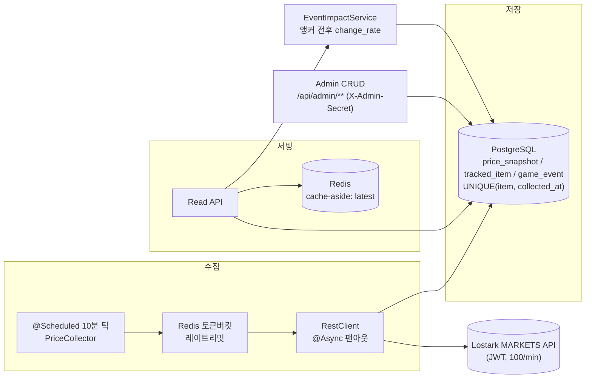

# 🎮 로스트아크 거래소 시세 트래커 (Lostark Market Tracker)

[](https://github.com/jongyeon2/lostark-market-tracker/actions/workflows/ci.yml)


> 로스트아크 거래소 아이템 시세를 **10분마다 자동으로 모아 기록**하고, 시세가 **언제·얼마나 움직였는지**를 차트로 보여주는 웹 서비스입니다. 게임이 소재일 뿐, 속을 뜯어보면 **주식·코인 시세를 모으는 파이프라인과 똑같은 구조**입니다.

### 🔗 라이브 데모 → **[lostark-tracker.duckdns.org](https://lostark-tracker.duckdns.org)**


---

## 이런 서비스예요

로스트아크에는 아이템을 사고파는 **거래소**가 있고, 시세는 하루에도 계속 바뀝니다. 이 사이트는 그 시세를 **사람이 지켜보지 않아도 10분마다 자동으로 수집**해 차곡차곡 쌓아두고, 품목별 **가격 흐름을 차트로**, 그리고 **어떤 게임 이벤트와 같은 시점에 움직였는지**를 함께 보여줍니다.

**왜 만들었나 —** 저는 로스트아크 유저이자 신입 백엔드 개발자입니다. 좋아하는 게임을 소재로, **외부 API에서 데이터를 빠짐없이 모아 저장하고 안정적으로 보여주는 파이프라인**을 직접 설계·구현한 **포트폴리오 프로젝트**입니다. 도메인만 게임일 뿐, 구조는 금융 시세 수집 파이프라인과 같습니다.

> ⚠️ 이벤트와 가격이 같은 시점에 겹친다는 건 **상관**이지 **인과**가 아닙니다. 데이터가 부족하면 억지로 계산하지 않고 "데이터 부족"으로 정직하게 표시합니다.

---

## 직접 보기

**🔗 [lostark-tracker.duckdns.org](https://lostark-tracker.duckdns.org)** — 배포된 사이트에서 바로 확인할 수 있습니다(설치 불필요).

| 화면 | 무엇을 보여주나 | 바로가기 |
|------|----------------|----------|
| **대시보드** | 수집 상태 + 품목별 최신가 워치리스트 | [열기](https://lostark-tracker.duckdns.org/dashboard) |
| **품목 타임라인** | 시세 라인 차트 + 기간 선택 + 이벤트 마커 | [예시(30일 딥링크)](https://lostark-tracker.duckdns.org/timeline?item=5&from=2026-06-13T03%3A11%3A14.463Z&to=2026-07-13T03%3A11%3A14.463Z) |
| **이벤트 영향** | 이벤트 전후 가격 변화율 | [열기](https://lostark-tracker.duckdns.org/impact) |

| 대시보드 — 수집 상태·워치리스트·로아 소식 | 이벤트 영향 — 전후 변화율 |
|:---:|:---:|
|  |  |

<sub>※ 이벤트 영향 화면은 관리자가 게임 이벤트를 등록하면 전후 변화율이 채워집니다. 데이터가 부족할 땐 위처럼 **정직하게 빈 상태**로 둡니다(억지로 수치를 만들지 않음).</sub>

---

## 기술 스택

| 영역 | 사용 기술 |
|------|-----------|
| **백엔드** | Java 21 · Spring Boot 3.4 · Spring Data JPA · Spring Security |
| **저장소** | PostgreSQL 16 (Flyway 마이그레이션) · Redis 7 (캐시 + 레이트리밋) |
| **프론트** | React 19 · TypeScript · Vite · Tailwind CSS · Recharts · TanStack Query |
| **테스트** | JUnit 5 · Mockito · Testcontainers (로컬·CI 동일 메커니즘) |
| **배포** | Docker Compose · Caddy (자동 HTTPS) · Oracle Cloud VM |

<sub>MSA · Kafka · Spring Batch는 포트폴리오 범위상 **의도적으로 제외**했습니다.</sub>

---

## 어떻게 배포했나

- **한 대의 VM(Oracle Cloud Always Free)** 에 **Docker Compose**로 앱 · PostgreSQL · Redis · Caddy를 함께 올립니다.
- **Caddy**가 유일한 공개 진입점이 되어 **자동 HTTPS(Let's Encrypt)** + 정적 프론트 서빙 + `/api` 프록시를 담당합니다(프론트·API 동일 출처 → CORS 불필요). DB · Redis · 앱은 내부 네트워크에 격리돼 외부에서 접근할 수 없습니다.
- `@Scheduled` 수집기가 **24/7** 상시 돌며 시세를 계속 쌓습니다.
- 배포 + 보안 하드닝(HTTPS · 보안 헤더/CSP · SSH 제한) 절차는 [`docs/deploy/oracle-vm-runbook.md`](docs/deploy/oracle-vm-runbook.md)에 정리했습니다.

---

## 어떻게 만들었나 (AI 협업)

이 프로젝트는 **Claude Code + GSD(Get Shit Done) 스펙 주도 워크플로우**로, 자연어로 설계·구현했습니다. 다만 "AI가 알아서" 만든 결과물이 아닙니다 —

- **아키텍처 · 데이터 모델 · 트레이드오프는 제가 결정**하고 그 근거를 문서로 남겼습니다.
- 모든 변경은 **계획 → 실행 → 검증** 단계를 거쳐 **원자적 커밋**으로 추적되고, **Testcontainers 통합 테스트**로 검증됩니다.
- 그래서 이 저장소의 코드는 **한 줄까지 "왜 이렇게 했는지" 설명할 수 있습니다** — 아래 접힌 "엔지니어링 상세"가 그 기록입니다.

> AI는 구현 속도를 높이는 도구였고, **설계 판단과 책임은 제가 집니다.**

---

<details>
<summary>📦 <b>엔지니어링 상세 펼치기</b> — 로컬 실행 · 아키텍처 · 설계 결정 · API · 프로젝트 구조 (면접관용 깊이)</summary>

<br/>

### 로컬 실행

**사전 요구:** JDK 21, Docker. *(프론트 데모까지 보려면 Node.js)*

```bash
# 1) 인프라 기동 (Postgres 16 + Redis 7)
cp .env.example .env
docker compose up -d

# 2) 앱 실행 — seed 프로파일: 합성 8일치 시세 + 데모 이벤트 (API 키 불필요, 즉시 재현)
./gradlew bootRun --args='--spring.profiles.active=seed'

# 3) 헤드라인 기능 호출
curl "http://localhost:8080/api/items/1/event-impact?window=24"
```

- **두 프로파일** — `seed`(합성 데이터, API 키 불필요·리뷰용) vs `dev`(`.env`의 `LOSTARK_API_KEY`로 실제 거래소 API를 호출해 실데이터 수집). 라이브 배포는 `dev` 성격의 실수집입니다.
- 관리자 콘솔(`/admin`)을 쓰려면 `.env`의 `ADMIN_API_SECRET`을 채우세요. 비어 있으면 `/api/admin/**`는 **fail-closed**로 모두 `401`(공개 읽기·수집은 정상).
- 빌드 + 전체 테스트: `./gradlew build` (CI가 동일 명령 실행). 프론트 데모: `cd frontend && npm install && npm run dev` → http://localhost:5173. 자세한 프론트 안내는 [`frontend/README`](frontend/README.md).

### 아키텍처 — collect → store → serve → correlate



`@Scheduled` 수집기가 10분마다 워치리스트를 Redis 토큰버킷 레이트리밋 아래 `@Async`로 병렬 호출해 `min_price`를 `price_snapshot`에 멱등 적재합니다(`UNIQUE(tracked_item_id, collected_at)` → 재시작·중복에도 시계열 무결). 읽기 API는 최신가를 Redis cache-aside로 서빙하고, 관리자가 등록한 `game_event`를 스냅샷 시계열과 시점 상관시켜 `event-impact`를 계산합니다.

### 설계 결정 (정직한 "왜")

- **왜 Redis** — 품목별 최신가 cache-aside 핫 리드 + 스케줄러 토큰버킷 레이트리밋. MVP 규모(~15품목)면 DB만으로도 읽기를 감당할 수 있음을 인정합니다. "다들 쓰니까"가 아니라 **패턴 증명 + 확장 시 옳은 선택**이라 씁니다.
- **왜 레이트리밋(토큰버킷)** — 외부 예산은 키당 분당 100회. 실제로는 한계에 못 미치지만 토큰버킷/요청 분산/429 처리를 **선제적으로 올바르게** 구현하고, 재시작·다중 인스턴스 정확성을 위해 Redis에 상태를 둡니다.
- **Approach A → B** — 1주차에 레이트리밋·캐시 없는 워킹 스켈레톤(A)으로 "수집→저장→조회"를 세우고, 그 위에 토큰버킷 / `@Async` 디커플링 / cache-aside / 범위 쿼리를 단계적으로(B) 올렸습니다.
- **상관 ≠ 인과** — `change_rate`는 시점 상관이지 인과 주장이 아닙니다. 윈도우 내 스냅샷이 희소·stale하면 계산하지 않고 `insufficient_data`로 응답합니다.
- **시각 enrichment** — 품목 아이콘·역할 배지(딜러/서포터/융화재료)는 API `Icon` 필드를 DB에 시드로 잠가 read 응답에 패스스루합니다. CDN이 막히거나 URL이 깨지면 역할색 글리프 타일로 **레이아웃 시프트 0** fallback. `role_group`은 금융의 "자산 섹터"와 동형입니다.

### API 예시 — event-impact (헤드라인)

이벤트별로 전(`pre`)·후(`post`) 앵커 스냅샷 `min_price`로 `changeRate = post / pre − 1`을 계산합니다. 두 앵커가 모두 신선(≤30분)할 때만 `status: "ok"`, 아니면 `insufficient_data`.

```bash
curl "http://localhost:8080/api/items/1/event-impact?window=24"
```

```json
{
  "itemId": 1, "window": 24,
  "events": [{
    "eventType": "LOA_ON", "title": "로아ON 쇼케이스",
    "occurredAt": "2026-06-22T15:05:00Z",
    "status": "ok", "prePrice": 1850, "postPrice": 2120, "changeRate": 0.1459
  }]
}
```

| 메서드 | 경로 | 설명 |
|--------|------|------|
| GET | `/api/items` | 워치리스트 |
| GET | `/api/items/{id}/prices?from=&to=` | 타임라인(큰 범위 자동 다운샘플) |
| GET | `/api/items/{id}/latest` | 최신가 (Redis cache-aside) |
| GET | `/api/health/collection` | 수집 파이프라인 헬스 |
| POST·PUT·DELETE | `/api/admin/**` | 품목·이벤트 CRUD (X-Admin-Secret, 미설정 시 401) |

시각은 UTC ISO-8601, 4xx는 `{timestamp, status, error, message}` 단일 계약을 따릅니다.

### 프로젝트 구조

```
src/main/java/com/lostark/tracker/
├── collect/     # 수집 — PriceCollector(@Scheduled), @Async 팬아웃
├── ratelimit/   # Redis 토큰버킷 레이트리밋
├── cache/       # 최신가 cache-aside
├── read/        # 읽기 서비스 — WindowQuery·Downsample·LatestPrice·EventImpact
├── domain/      # 엔티티 — TrackedItem·PriceSnapshot·GameEvent·CollectionRun
├── web/         # 컨트롤러 + DTO + 전역 에러 핸들러 (+ admin/)
├── security/    # X-Admin-Secret 필터 (fail-closed)
└── seed/        # seed 프로파일 합성 데이터
frontend/        # React 19 + Vite 데모 (3화면) — 같은 read API 소비
docs/deploy/     # Oracle VM 배포 런북
.planning/       # 단계별 계획·결정 기록 (GSD)
```

### 스코프 / 한계

- **데이터 소스:** 거래소(MARKETS)만. 경매장/보석은 v2.
- **단일 인스턴스:** 단일 박스(Oracle VM · Docker Compose) 상시 운영. 다중 인스턴스 HA는 v2 (프로세스 다운 시 시계열 구멍은 `insufficient_data`로 정직하게 노출).
- **데이터 보존:** MVP는 삭제 없이 원본 스냅샷 보존(복합 인덱스로 감당). 롤업/파티셔닝은 v2.

</details>

---

## 👤 개발자

- **개발:** jongyeon ([@jongyeon2](https://github.com/jongyeon2)) — 단일 개발자
- **기간:** 2026.06 ~ 2026.07 (약 1개월)
- **유형:** 신입 백엔드 포트폴리오 — "설명 가능한 엔지니어링" (도메인=게임, 구조=금융 시세 파이프라인)
- **저장소:** [github.com/jongyeon2/lostark-market-tracker](https://github.com/jongyeon2/lostark-market-tracker)
