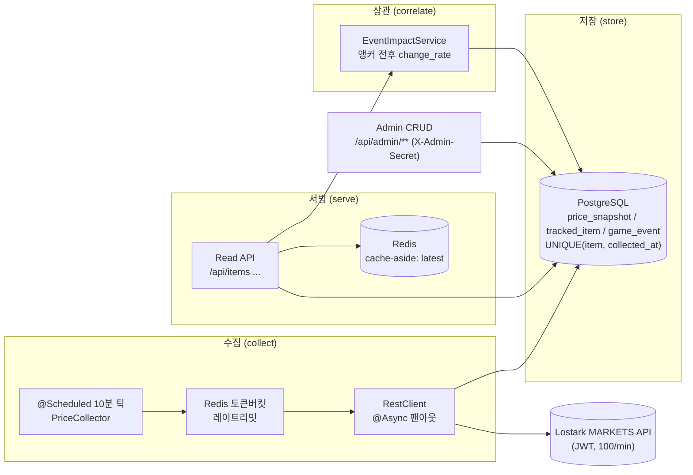
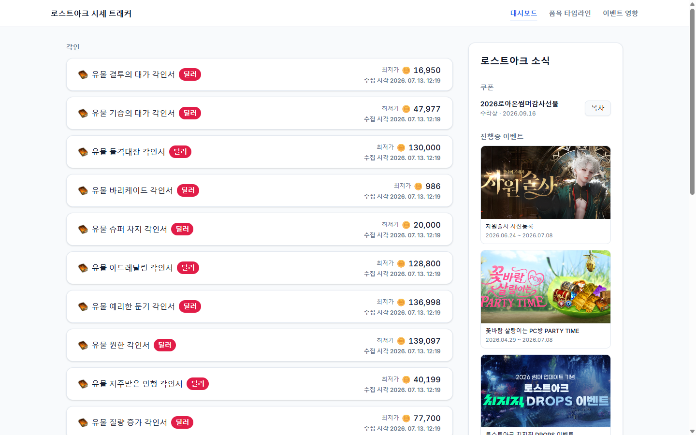

# Lostark Market Tracker


레이트리밋이 걸린 **로스트아크 거래소(MARKETS) Open API**에서 시세를 10분 주기로 빠짐없이 수집해 시계열로 적재하고, Redis 캐시 계층으로 안정적으로 서빙하며, 관리자가 등록한 **주요 게임 이벤트와 가격 변동을 시점 상관**시키는 백엔드 데이터 파이프라인입니다. 도메인은 게임이지만 구조는 금융 마켓 데이터 파이프라인과 동일합니다.

**핵심 가치:** 외부 마켓 API에서 시세를 빠짐없이 수집·저장·서빙한다. 그 위에 얹는 헤드라인 기능이 **event-impact**(이벤트 전후 가격 변화율 상관)입니다.

백엔드가 헤드라인입니다 — **JSON이 곧 API 표면**입니다. 아래 `curl` 예시 + 샘플 응답으로 전체 기능을 재현할 수 있고, 같은 read API를 소비하는 **브라우저 프론트 데모**(3화면)도 선택적으로 제공합니다.

---

## 한눈에 — 3단계 재현 (success criterion 4)

API 키 없이, 시드 모드로 비어있지 않은 `event-impact` 응답을 재현합니다.

```bash
# 1) 인프라 기동 (Postgres 16 + Redis 7)
cp .env.example .env
docker compose up -d

# 2) seed 프로파일로 앱 실행 — 합성 8일치 시세 + 데모 이벤트를 채움 (LOSTARK_API_KEY 불필요)
./gradlew bootRun --args='--spring.profiles.active=seed'

# 3) 헤드라인 기능 호출 — status "ok" 와 실제 change_rate 가 담긴 events 배열이 반환됨
curl "http://localhost:8080/api/items/1/event-impact?window=24"
```

---

## 아키텍처



**데이터 흐름 (collect → store → serve → correlate):** `@Scheduled` 수집기가 10분마다 워치리스트를 Redis 토큰버킷 레이트리밋 아래 `@Async`로 병렬 호출해 `min_price`를 `price_snapshot`에 멱등 적재(`UNIQUE(tracked_item_id, collected_at)`)합니다. 읽기 API는 최신가를 Redis cache-aside로 서빙하고 타임라인/다운샘플은 DB 범위 쿼리로 응답합니다. 관리자가 시크릿 게이트 뒤에서 등록한 `game_event`를 스냅샷 시계열과 시점 상관시켜 `event-impact`를 계산합니다.

---

## 설계 결정 & 트레이드오프 (정직한 "왜")

- **왜 Redis** — (a) 품목별 **최신가 cache-aside** 핫 리드 경로, (b) 스케줄러 **토큰버킷 레이트리밋**. MVP 규모(~12품목)면 DB만으로 읽기를 감당할 수 있음을 인정합니다. "다들 쓰니까"가 아니라 **패턴 증명 + 확장 시 옳은 선택**이라 씁니다. 수집기가 스냅샷을 쓸 때 최신가 키를 갱신해 stale 캐시를 방지합니다.
- **왜 레이트리밋 (per-key 토큰버킷)** — 외부 예산은 **키당 분당 100회**(`x-ratelimit-limit: 100`, Task 0 확인). 거래소 검색은 1요청에 여러 품목을 반환하므로 실제로는 한계에 한참 못 미치지만, **토큰버킷/요청 분산/429 처리를 선제적으로 올바르게** 구현합니다. 재시작·다중 인스턴스 정확성을 위해 Redis에 `(tokens, lastRefillTs)`를 두고 lazy refill합니다.
- **왜 @Async** — API 지연이 10분 틱을 막지 않도록 수집 태스크를 바운드 스레드풀에 위임합니다. **이 규모에서 엄밀히 필수는 아니며, 패턴의 쇼케이스임을 솔직히 인정**합니다(JPA×@Async의 영속성 컨텍스트 미전파 함정은 "새 트랜잭션 + ID 전달"로 회피).
- **Approach A → B** — 1주차에 레이트리밋·캐시 없는 **워킹 스켈레톤(A)**으로 "수집→저장→조회"를 세우고, 그 위에 Redis 토큰버킷 / `@Async` 디커플링 / cache-aside / 복합 인덱스 범위 쿼리를 **단계적으로(B)** 올렸습니다.
- **상관 ≠ 인과** — `event-impact`의 `change_rate`는 "이벤트와 가격이 시점상 겹친다(**상관**)"는 의미이지 "이벤트가 가격을 올렸다(**인과**)"가 아닙니다. 응답 문구와 문서는 과대 주장을 하지 않습니다. 윈도우 내 스냅샷이 희소하거나 stale하면 계산하지 않고 `insufficient_data`로 응답합니다.

---

## 로컬 실행

**사전 요구:** JDK 21, Docker (Testcontainers/compose용).

```bash
# 1) 환경 변수 — .env.example 을 복사해서 사용 (실제 비밀값은 절대 커밋하지 않음)
cp .env.example .env

# 2) Postgres 16 + Redis 7 기동
docker compose up -d
```

앱은 두 가지 방식으로 실행합니다.

```bash
# (a) dev 프로파일 — 실시간 수집. LOSTARK_API_KEY 가 있어야 실제 API 를 호출
LOSTARK_API_KEY=<your-jwt> ./gradlew bootRun --args='--spring.profiles.active=dev'

# (b) seed 프로파일 — 합성 8일치 시세 + 데모 이벤트를 채움. API 키 불필요 (데모/리뷰용)
./gradlew bootRun --args='--spring.profiles.active=seed'
```

- `ADMIN_API_SECRET` 이 비어 있으면 `/api/admin/**` 는 **fail-closed**로 모두 `401` 입니다(공개 읽기 표면과 수집 파이프라인은 정상 동작). 관리자 호출을 쓰려면 `.env` 에 값을 채우세요.
- 빌드 + 전체 테스트: `./gradlew build` (CI가 동일 명령 실행). 로컬 테스트는 Docker 필요, `-PdockerApiVersion=1.44` 권장.

---

## 프론트 데모 (브라우저)

curl이 아니라 브라우저로 보고 싶다면, 같은 read API를 소비하는 **데스크톱 우선 React 데모(3화면)** 를 띄울 수 있습니다.

1. **seed 백엔드 기동** — 위 "로컬 실행"의 seed 프로파일(`./gradlew bootRun --args='--spring.profiles.active=seed'`, API 키 불필요).
2. **프론트 기동** — `cd frontend && npm install && npm run dev` → http://localhost:5173
3. **3화면** — Dashboard(`/`) · Item Timeline(`/timeline`) · Event Impact(`/impact`)



자세한 실행·Vite 프록시 설명·화면별 안내는 [`frontend/README`](frontend/README.md)에 일원화돼 있습니다(단일 진실 원천). **curl로도, 브라우저로도 동일한 read API** 를 보며, 데이터는 seed 합성 데이터입니다.

---

## 데모 — curl + 샘플 JSON

모든 인스턴스는 `http://localhost:8080` 기준입니다. 시각은 UTC ISO-8601(`...Z`)이며, 4xx 오류는 `{timestamp, status, error, message}` 단일 계약을 따릅니다.

### 1) 워치리스트 조회 — `GET /api/items`

```bash
curl "http://localhost:8080/api/items"
```

```json
[
  { "id": 1, "externalItemId": "66102101", "displayName": "수호석 조각", "category": "50010", "active": true },
  { "id": 2, "externalItemId": "66102102", "displayName": "파괴석 조각", "category": "50010", "active": true }
]
```

### 2) 타임라인 — `GET /api/items/{id}/prices?from=&to=`

`from`/`to` 는 UTC ISO-8601. 큰 범위는 서버에서 자동 다운샘플(`downsampled: true`, `bucketWidth: "hour"|"day"`)됩니다. `to <= from` 이면 `400`, 없는 품목이면 `404`.

```bash
curl "http://localhost:8080/api/items/1/prices?from=2026-06-21T00:00:00Z&to=2026-06-22T00:00:00Z"
```

```json
{
  "downsampled": false,
  "bucketWidth": null,
  "snapshots": [
    { "collectedAt": "2026-06-21T00:00:00Z", "minPrice": 1850, "sampleCount": null },
    { "collectedAt": "2026-06-21T00:10:00Z", "minPrice": 1872, "sampleCount": null }
  ],
  "events": [
    { "occurredAt": "2026-06-21T15:05:00Z", "eventType": "LOA_ON", "title": "로아ON 쇼케이스" }
  ]
}
```

### 3) event-impact (헤드라인) — `GET /api/items/{id}/event-impact?window=N`

`window` 는 필수 정수(시간, 1..168). 이벤트별로 전(`pre`)·후(`post`) 앵커 스냅샷 `min_price` 로 `changeRate = post / pre − 1` 을 계산합니다. 두 앵커가 모두 신선(이벤트와 ≤30분)할 때만 `status: "ok"`, 아니면 `insufficient_data`.

```bash
curl "http://localhost:8080/api/items/1/event-impact?window=24"
```

```json
{
  "itemId": 1,
  "window": 24,
  "events": [
    {
      "id": 7,
      "eventType": "LOA_ON",
      "title": "로아ON 쇼케이스",
      "occurredAt": "2026-06-22T15:05:00Z",
      "status": "ok",
      "preAnchorAt": "2026-06-22T15:00:00Z",
      "postAnchorAt": "2026-06-22T15:10:00Z",
      "prePrice": 1850,
      "postPrice": 2120,
      "changeRate": 0.1459
    }
  ]
}
```

> `changeRate` 는 **시점 상관**이며 인과의 주장이 아닙니다.

### 4) 관리자 이벤트 등록 — `POST /api/admin/events` (X-Admin-Secret)

`/api/admin/**` 는 `X-Admin-Secret` 헤더로 보호됩니다(시크릿 미설정 시 `401`). 비밀값은 환경 변수(`$ADMIN_API_SECRET`)로만 전달하고 절대 커밋하지 않습니다.

```bash
curl -X POST "http://localhost:8080/api/admin/events" \
  -H "Content-Type: application/json" \
  -H "X-Admin-Secret: $ADMIN_API_SECRET" \
  -d '{ "eventType": "MAJOR_UPDATE", "title": "여름 대규모 업데이트", "occurredAt": "2026-06-22T15:05:00Z", "description": "5.0 패치" }'
```

```json
{
  "id": 8,
  "eventType": "MAJOR_UPDATE",
  "title": "여름 대규모 업데이트",
  "occurredAt": "2026-06-22T15:05:00Z",
  "description": "5.0 패치",
  "createdAt": "2026-06-25T01:00:00Z",
  "updatedAt": "2026-06-25T01:00:00Z"
}
```

### 그 외 엔드포인트

| 메서드 | 경로 | 설명 |
|--------|------|------|
| GET | `/api/items/{id}/latest` | 최신가 (Redis cache-aside) — `{ itemId, minPrice, collectedAt }` |
| GET | `/api/health/collection` | 수집 파이프라인 헬스 — `{ lastRunAt, startedAt, itemsAttempted, itemsSucceeded, itemsFailed, status, summaryMessage }` |
| GET | `/actuator/health` | 인프라 liveness (Spring Boot Actuator) |
| POST | `/api/admin/items` | 품목 등록 `201`/재활성 `200`/중복 `409` (X-Admin-Secret) |
| DELETE | `/api/admin/items/{id}` | 품목 soft-delete `204` (X-Admin-Secret) |
| PUT | `/api/admin/events/{id}` | 이벤트 전체 교체 `200` (X-Admin-Secret) |
| DELETE | `/api/admin/events/{id}` | 이벤트 삭제 `204` (X-Admin-Secret) |

오류 응답 예 (`window` 범위 위반 → `400`):

```json
{ "timestamp": "2026-06-25T01:00:00Z", "status": 400, "error": "Bad Request", "message": "window must be a positive number of hours" }
```

---

## API 한계 / 스코프

- **데이터 소스:** 거래소(MARKETS)만. 경매장/보석은 v2.
- **레이트리밋:** 키당 분당 100회(`x-ratelimit-*` 헤더 제공). 토큰버킷으로 선제 대응.
- **다운샘플:** 큰 범위 타임라인은 서버에서 `date_trunc` 버킷 평균으로 축약.
- **단일 인스턴스:** 다중 인스턴스 HA는 v2 (프로세스 다운 시 시계열 구멍은 `event-impact` `insufficient_data` 로 정직하게 노출).

## 데이터 보존 정책

MVP는 **삭제 정책 없이 원본 스냅샷을 보존**합니다. 예상 규모는 `(tracked_item_id, collected_at)` 복합 인덱스로 감당 가능합니다. **롤업 / 파티셔닝 / 장기 보존은 v2**로 미룹니다.

---

## 기술 스택 & 문서

- **스택:** Java 21 · Spring Boot 3.4 · Spring Data JPA · PostgreSQL 16 · Redis 7 · Flyway · Spring Security · Testcontainers (MSA·Kafka·Spring Batch 명시적 제외)
- **테스트:** JUnit 5 + Mockito + Testcontainers(Postgres + Redis) — 로컬·CI 동일 메커니즘. `./gradlew build` 가 전체 통합 스위트를 실행하고, CI 배지가 그 결과를 반영합니다.
- **설계 문서:** [`docs/design/yeonjong-unknown-design-20260619-221517.md`](docs/design/yeonjong-unknown-design-20260619-221517.md)
- **단계별 계획:** [`.planning/phases/`](.planning/phases/) (Phase 1 골격 → 2 수집 → 3 읽기/캐시 → 4 관리자 → 5 event-impact → 6 배포/문서)
