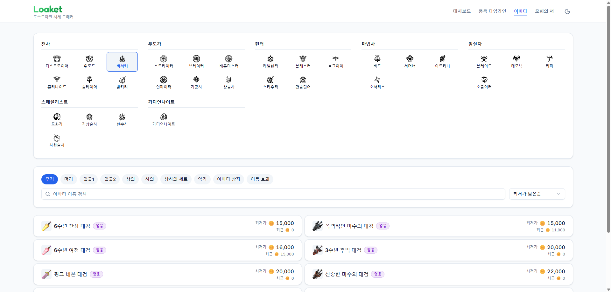
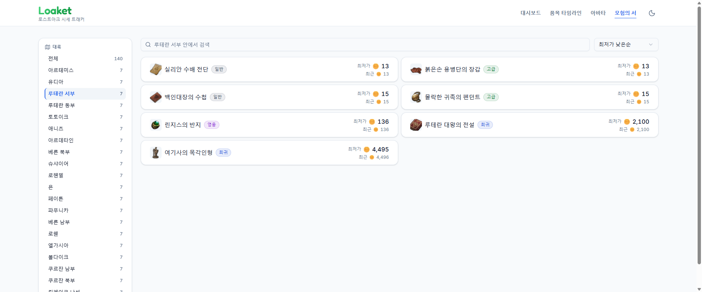
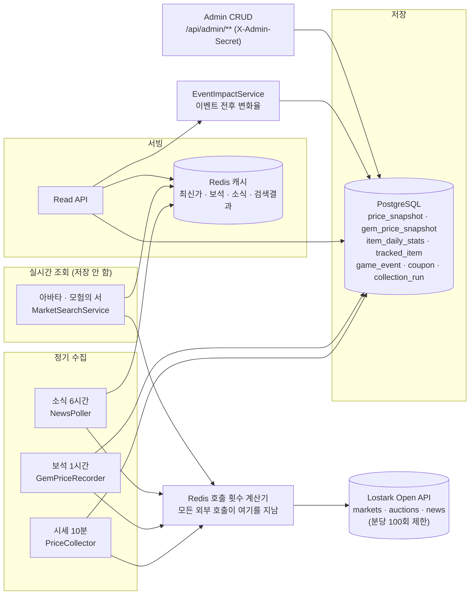

# 🎮 Loaket (로스트아크 아이템 시세 트래커)

[](https://github.com/jongyeon2/lostark-market-tracker/actions/workflows/ci.yml)


<sub>※ 스마일게이트와 무관한 **비공식 개인 프로젝트**입니다. 로스트아크 관련 명칭·이미지의 권리는 스마일게이트에 있으며, 게임 데이터는 공식 오픈 API로 조회합니다.</sub>

> 로스트아크 거래소 시세를 10분마다 자동으로 모아 쌓고, 차트로 보여주는 웹 서비스입니다.<br>
> 소재는 게임이지만 구조는 주식·코인 시세 수집 파이프라인과 같습니다.

### 🔗 **[loaket.kr](https://loaket.kr)** — 설치 없이 바로 볼 수 있습니다


---

## 무엇을 하나

거래소 시세는 하루에도 계속 바뀌는데 사람이 계속 지켜볼 수는 없습니다. 그래서 10분마다 자동으로 모아 쌓아두고 네 가지 화면으로 보여줍니다.

| 화면 | 무엇을 보여주나 | 바로가기 |
|------|----------------|----------|
| **대시보드** | 관심 아이템 시세 + 이벤트 영향 + 로아 소식 | [열기](https://loaket.kr/dashboard) |
| **아이템 타임라인** | 시세 라인 차트 + 기간 선택 + 이벤트 마커 | [열기](https://loaket.kr/timeline) |
| **아바타** | 직업별 아바타 실시간 시세 | [열기](https://loaket.kr/avatar) |
| **모험의 서** | 대륙별 수집품 실시간 시세 | [열기](https://loaket.kr/adventure) |

| 대시보드 | 이벤트 영향 |
|:---:|:---:|
|  |  |

| 아바타 | 모험의 서 |
|:---:|:---:|
|  |  |

<sub>※ 이벤트 영향은 관리자가 이벤트를 등록하면 채워집니다. 아직 등록된 이벤트가 하나뿐이라 위 화면은 1건만 보여줍니다.</sub>

## 왜 만들었나

- **가격이 언제 움직였는지 눈으로 보고 싶었습니다.** 게임 안 차트는 가격만 보여줄 뿐, 밸런스 패치나 신규 레이드와 겹쳐서 보여주진 않습니다.
- **아바타·모험의 서(대륙별 수집품)를 훑어보기 불편했습니다.** 거래소에선 드롭다운을 하나씩 바꿔가며 확인해야 해서, 직업 아이콘 바둑판과 대륙 목록으로 한눈에 고르게 만들었습니다.
- **시세 파이프라인을 직접 만들어보고 싶었습니다.** 외부 API에서 데이터를 빠짐없이 모아 시계열로 쌓고 캐시로 서빙하는 구조는, 도메인만 바뀔 뿐 금융 마켓 데이터와 같습니다.

## 기술 스택

| 영역 | 사용 기술 |
|------|-----------|
| **백엔드** | Java 21 · Spring Boot 3.4 · Spring Data JPA · Spring Security |
| **저장소** | PostgreSQL 16 (Flyway) · Redis 7 (캐시 + 호출 제한) |
| **프론트** | React 19 · TypeScript · Vite · Tailwind CSS · Recharts · TanStack Query |
| **테스트** | JUnit 5 · Mockito · Testcontainers (로컬·CI 동일) |
| **배포** | Docker Compose · Caddy (자동 HTTPS) · Oracle Cloud VM |

<sub>MSA · Kafka · Spring Batch는 포트폴리오 범위상 의도적으로 제외했습니다.</sub>

## 어떻게 동작하나



- **정기 수집** — 시세는 10분, 보석은 1시간, 로아 공식 소식은 6시간마다 알아서 가져옵니다.
- **실시간 조회** — 아바타·모험의 서는 종류가 너무 많아 쌓지 않습니다. 누가 찾을 때만 가져와 잠깐 들고 있습니다.
- **같은 시각은 한 번만** — 앱을 재시작하거나 요청이 겹쳐도 같은 시각의 시세가 두 줄로 쌓이지 않습니다.

## 설계에서 고민한 것

- **호출 횟수를 한 곳에서 셉니다.** 외부 API는 키 하나당 분당 100회까지만 받아주고, 넘기면 수집이 통째로 막힙니다. 외부 API를 부르는 길이 네 갈래인데 전부 같은 계산기를 지나게 했습니다 — 따로 세면 각자는 한도를 지켜도 합치면 넘습니다.
- **이벤트가 원인이라고 말하지 않습니다.** 보여주는 건 "이벤트 무렵 가격이 이만큼 변했다"는 사실뿐입니다. 그 시간대에 쌓인 시세가 없거나 너무 오래됐으면 계산하지 않고 "데이터 부족"이라고 씁니다. 화면이 비어 보이더라도 없는 숫자를 지어내는 것보다 낫다고 봤습니다.
- **먼저 굴러가게, 그다음 튼튼하게.** 1주차엔 제한도 캐시도 없이 "가져와서 저장하고 보여주기"만 되는 뼈대를 만들었고, 그게 실제로 도는 걸 본 뒤에 호출 제한·비동기 처리·캐시를 하나씩 얹었습니다. 처음부터 다 넣었으면 어디가 문제인지 가려내기 어려웠을 겁니다.

### 대표 API — 이벤트 전후로 가격이 얼마나 변했나

이벤트 직전 가격과 직후 가격을 하나씩 골라 `변화율 = 직후 / 직전 − 1`로 계산합니다. 양쪽 다 이벤트에서 30분 안쪽일 때만 값을 내고(`ok`), 하나라도 없거나 너무 오래됐으면 `insufficient_data`로 답합니다.

```bash
curl "http://localhost:8080/api/items/1/event-impact?window=24"
```

```json
{
  "itemId": 1, "window": 24, "totalCount": 12,
  "events": [{
    "eventType": "LOA_ON", "title": "로아ON 쇼케이스",
    "occurredAt": "2026-06-22T15:05:00Z",
    "status": "ok", "prePrice": 1850, "postPrice": 2120, "changeRate": 0.1459
  }]
}
```

## 어떻게 배포했나

- **VM 한 대**(Oracle Cloud Always Free)에 Docker Compose로 앱·PostgreSQL·Redis·Caddy를 함께 올립니다.
- **Caddy가 유일한 공개 진입점**입니다 — 자동 HTTPS, 정적 프론트 서빙 + `/api` 프록시(같은 출처라 CORS 불필요), DB·Redis·앱은 내부 네트워크에 격리.
- **수집기는 24/7 상시 동작**합니다 (`@Scheduled`).
- **`main`에 푸시하면 자동 배포됩니다** — 테스트 → 이미지 빌드(GHCR) → VM 접속(Tailscale) → 무중단 교체 → HTTPS 헬스체크. 문제가 생기면 이전 이미지로 즉시 롤백.
- 배포·보안·장애 대응 절차는 [`docs/deploy/oracle-vm-runbook.md`](docs/deploy/oracle-vm-runbook.md)에 있습니다.

## AI를 어떻게 썼나

Claude Code와 스펙 주도 워크플로우(GSD)로 만들었습니다. 다만 "AI가 알아서" 만든 결과물은 아닙니다.

- 아키텍처·데이터 모델·트레이드오프는 **제가 결정**하고 근거를 `.planning/`에 문서로 남겼습니다.
- 모든 변경은 계획 → 실행 → 검증을 거쳐 원자적 커밋으로 남고, Testcontainers 통합 테스트로 검증합니다.

> AI는 속도를 높이는 도구였고, **설계 판단과 책임은 제가 집니다.**

---

<details>
<summary>📦 <b>개발자용 상세 펼치기</b> — 로컬 실행 · 전체 API · 설계 결정 더보기 · 프로젝트 구조</summary>

<br/>

### 로컬 실행

**필요한 것:** JDK 21, Docker *(프론트까지 보려면 Node.js)*

```bash
# 1) 인프라 기동 (Postgres 16 + Redis 7)
cp .env.example .env
docker compose up -d

# 2) 앱 실행 — 미리 만들어 둔 예시 데이터로 뜹니다 (API 키 없어도 됨)
./gradlew bootRun --args='--spring.profiles.active=seed'

# 3) 대표 기능 확인 — 이벤트 전후로 가격이 얼마나 변했는지
curl "http://localhost:8080/api/items/1/event-impact?window=24"
```

- **실행 방식 2가지**
  - `seed` — 미리 만들어 둔 예시 데이터로 띄웁니다. API 키가 없어도 화면이 채워져 있어 바로 둘러볼 수 있습니다.
  - `dev` — `.env`에 로스트아크 API 키를 넣고 진짜 거래소에서 시세를 가져옵니다. 배포된 사이트가 이 방식으로 돕니다.
- 관리자 화면(`/admin`)을 쓰려면 `.env`에 `ADMIN_API_SECRET`을 넣어야 합니다. 안 넣으면 관리자 기능이 전부 막힙니다 — 설정을 빠뜨렸을 때 열리는 게 아니라 잠기는 쪽이 안전하다고 봤습니다.
- 전체 테스트는 `./gradlew build` 한 줄입니다. CI도 똑같은 명령을 씁니다.
- 화면까지 보려면 `cd frontend && npm install && npm run dev` → http://localhost:5173

### 전체 API

| 메서드 | 경로 | 설명 |
|--------|------|------|
| GET | `/api/items` | 관심 아이템 목록 |
| GET | `/api/items/{id}/prices?from=&to=` | 기간별 시세 (범위가 넓으면 알아서 솎아서 내려줍니다) |
| GET | `/api/items/{id}/latest` | 최신가 (Redis 캐시) |
| GET | `/api/items/{id}/event-impact` | 이벤트 전후 변화율 (종류·정렬·개수 필터) |
| GET | `/api/gems` | 보석 현재가 |
| GET | `/api/market/avatar`, `/api/market/adventure` | 아바타·모험의 서 실시간 조회 |
| GET | `/api/news`, `/api/coupons` | 로아 공식 소식 · 쿠폰 |
| GET | `/api/health/collection` | 수집이 잘 돌고 있는지 확인 |
| POST·PUT·DELETE | `/api/admin/**` | 아이템·이벤트 CRUD (X-Admin-Secret) |

- 시각은 전부 세계 표준시(UTC)로 내려주고, 한국 시간으로 바꾸는 건 화면에서 합니다. 서버가 미리 바꿔서 내려주면 시간대가 다른 곳에서 9시간씩 어긋납니다.
- 요청이 잘못됐을 때는 전부 같은 모양으로 답합니다 — `{timestamp, status, error, message}`.

### 설계 결정 더보기

- **왜 Redis를 썼나** — 자주 읽히는 최신가를 잠깐 담아두고, 외부 API 호출 횟수를 세는 데 씁니다. 솔직히 지금 규모(49종)면 DB만으로도 충분합니다. 다만 호출 횟수는 앱을 재시작해도 이어져야 해서 DB보다 Redis가 맞다고 봤습니다.
- **아이콘이 안 떠도 화면이 흔들리지 않게** — 아이템 아이콘은 로스트아크 서버의 이미지 주소를 그대로 씁니다. 그 서버가 막히면 이미지가 사라지면서 줄이 위아래로 밀리므로, 실패하면 같은 크기의 대체 그림을 같은 자리에 그려 자리가 비지 않게 했습니다.

### 프로젝트 구조

```
src/main/java/com/lostark/tracker/
├── collect/     # 10분마다 시세를 모아오는 곳
├── ratelimit/   # 외부 API를 몇 번 불렀는지 세고, 한도 전에 멈추는 곳
├── cache/       # 자주 읽는 값을 잠깐 들고 있는 곳
├── read/        # 화면에 내려줄 데이터를 골라서 다듬는 곳
├── market/      # 아바타·모험의 서 실시간 조회 (저장 안 함)
├── gem/         # 보석 현재가 + 1시간마다 기록
├── news/        # 로아 공식 소식·이벤트 가져오기
├── domain/      # DB 테이블과 짝이 되는 클래스
├── web/         # 요청을 받고 응답을 돌려주는 곳 + 오류 처리
├── security/    # 관리자 인증 (설정 안 하면 잠김)
└── seed/        # 예시 데이터 만들기
frontend/        # 화면 (React, 4개 페이지 + 다크모드)
docs/deploy/     # 배포·장애 대응 절차서
docs/specs/      # 코드를 짜기 전에 먼저 그린 설계 문서
.planning/       # 무엇을 왜 그렇게 정했는지 남긴 기록
```

</details>

---

## 👤 개발자

- **개발** — jongyeon ([@jongyeon2](https://github.com/jongyeon2)), 단일 개발자
- **기간** — 2026.06 ~ 2026.07 (약 1개월)
- **유형** — 신입 백엔드 포트폴리오. 도메인은 게임, 구조는 금융 시세 파이프라인
- **저장소** — [github.com/jongyeon2/lostark-market-tracker](https://github.com/jongyeon2/lostark-market-tracker)
