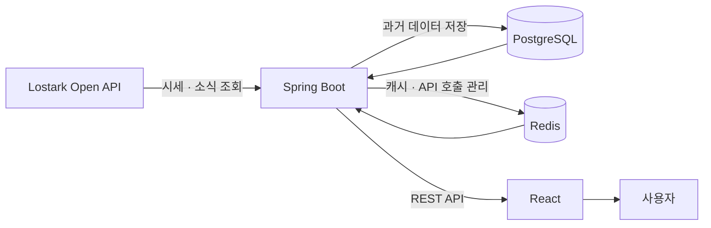

# 🎮 Loaket

**로스트아크 거래소 시세 수집·분석 서비스**

[](https://github.com/jongyeon2/lostark-market-tracker/actions/workflows/ci.yml)


> 로스트아크 거래소의 아이템 가격을 주기적으로 수집하고 저장해
> **과거 가격 변화와 게임 이벤트 전후의 시세를 확인할 수 있는 웹 서비스**입니다.

### 🔗 [loaket.kr](https://loaket.kr) — 현재 실제 서비스 운영 중


<sub>※ 스마일게이트와 무관한 비공식 개인 프로젝트입니다. 로스트아크 관련 명칭·이미지의 권리는 스마일게이트에 있으며, 게임 데이터는 공식 Open API를 이용합니다.</sub>

---

## 프로젝트 소개

로스트아크 거래소의 가격은 계속 변하지만 게임 안에서는 과거 가격의 흐름이나 주요 이벤트 전후의 변화를 한눈에 확인하기 어렵습니다.

Loaket은 거래소 데이터를 **10분마다 자동으로 수집·저장**하고, 이를 차트로 보여주어 시간에 따른 가격 변화를 확인할 수 있도록 만든 서비스입니다.

아바타와 모험의 서 수집품처럼 종류가 많은 아이템은 필요한 시점에 실시간으로 조회할 수 있도록 구성했습니다.

---

## 주요 기능

| 기능            | 설명                          |
| ------------- | --------------------------- |
| **아이템 시세 조회** | 관심 아이템의 현재 가격과 최근 가격 변화를 확인 |
| **가격 타임라인**   | 기간별 가격 변화를 차트로 확인           |
| **이벤트 비교**    | 업데이트·행사 전후의 아이템 가격 변화를 비교   |
| **아바타 시세**    | 직업별 아바타의 현재 거래소 가격을 조회      |
| **모험의 서 시세**  | 대륙별 수집품의 현재 거래소 가격을 조회      |
| **로스트아크 소식**  | 공식 소식과 주요 정보를 함께 확인         |

|                       대시보드                       |                      이벤트 전후 가격 비교                     |
| :----------------------------------------------: | :---------------------------------------------------: |
|  |  |

|                      아바타                     |                       모험의 서                       |
| :------------------------------------------: | :-----------------------------------------------: |
|  |  |

---

## 왜 만들었나

### 과거 가격 변화를 확인하고 싶었습니다

게임 내 거래소에서는 현재 가격을 확인할 수 있지만, 가격이 **언제부터 어떻게 변했는지** 살펴보기 어렵습니다.

그래서 시세를 일정한 주기로 직접 수집하고 저장해 과거 가격 흐름을 확인할 수 있도록 만들었습니다.

### 게임 이벤트와 가격 변화를 함께 보고 싶었습니다

밸런스 패치나 신규 레이드 같은 이벤트 전후로 아이템 가격이 크게 변하는 경우가 있습니다.

이벤트가 발생한 시점과 가격 데이터를 함께 보여주어 **이벤트 전후에 가격이 어떻게 달라졌는지 비교**할 수 있도록 구현했습니다.

### 실제로 운영되는 서비스를 만들어보고 싶었습니다

단순히 기능을 구현하는 데서 끝내지 않고,

**외부 API 연동 → 데이터 수집 → 저장 → 조회 → 캐싱 → 테스트 → 배포 → 운영**

까지 서비스의 전체 흐름을 직접 경험하는 것을 목표로 개발했습니다.

---

## 핵심 구현

### API 호출 제한 관리

로스트아크 Open API에는 분당 호출 횟수 제한이 있습니다.

시세 수집, 보석 조회, 소식 조회 등 여러 기능이 동시에 API를 사용하더라도 제한을 넘지 않도록 **Redis와 Lua Script를 이용해 전체 호출 횟수를 한 곳에서 관리**했습니다.

### 중복 데이터 방지

수집 작업이 다시 실행되거나 서버가 재시작되더라도 동일한 시점의 가격 데이터가 중복 저장되지 않도록 **아이템과 수집 시각을 기준으로 DB 제약조건을 적용**했습니다.

### Redis 장애 대응

최신 가격과 자주 조회되는 데이터는 Redis에 저장해 빠르게 제공하지만, Redis에 문제가 발생했을 때 서비스 전체 조회가 중단되지 않도록 **PostgreSQL 조회로 자동 전환**하도록 구성했습니다.

### 데이터가 부족하면 결과를 만들지 않습니다

이벤트 전후의 가격을 비교할 때 충분한 시세 데이터가 없는 경우 임의의 값을 계산하지 않고 **데이터 부족 상태로 표시**합니다.

가격의 변화는 보여주되 특정 이벤트가 가격 변화의 직접적인 원인이라고 단정하지 않도록 구성했습니다.

---

## 서비스 구조



* 거래소 시세는 **10분마다 자동으로 수집**합니다.
* 과거 시세는 PostgreSQL에 저장합니다.
* 자주 조회하는 데이터와 API 호출 횟수는 Redis로 관리합니다.
* React 기반 화면에서 기간별 가격 변화와 이벤트 전후의 변화를 확인할 수 있습니다.

---

## 기술 스택

| 영역                   | 사용 기술                                                              |
| -------------------- | ------------------------------------------------------------------ |
| **Backend**          | Java 21, Spring Boot 3.4, Spring Data JPA, Spring Security         |
| **Database / Cache** | PostgreSQL 16, Redis 7, Flyway                                     |
| **Frontend**         | React 19, TypeScript, Vite, Tailwind CSS, Recharts, TanStack Query |
| **Test**             | JUnit 5, Mockito, Testcontainers                                   |
| **Infra / DevOps**   | Docker Compose, Caddy, GitHub Actions, Oracle Cloud                |

---

## 배포 및 운영

Oracle Cloud VM에 Docker 기반으로 배포해 현재 실제 서비스를 운영하고 있습니다.

`main` 브랜치에 코드가 반영되면 GitHub Actions를 통해

**테스트 → Docker 이미지 빌드 → 서버 배포 → 헬스 체크**

과정이 자동으로 실행됩니다.

배포·보안·장애 대응 절차는 [`docs/deploy/oracle-vm-runbook.md`](docs/deploy/oracle-vm-runbook.md)에 정리했습니다.

---

<details>
<summary><b>📦 개발자용 상세 정보</b></summary>

<br/>

### 로컬 실행

**필요 환경**

* JDK 21
* Docker
* Node.js *(Frontend 실행 시)*

```bash
# PostgreSQL + Redis 실행
cp .env.example .env
docker compose up -d

# Backend 실행
./gradlew bootRun --args='--spring.profiles.active=seed'
```

`seed` 프로필을 사용하면 로스트아크 API Key 없이 예시 데이터로 서비스를 실행할 수 있습니다.

실제 API를 사용하려면 `.env`에 로스트아크 API Key를 설정하고 `dev` 프로필로 실행합니다.

전체 테스트:

```bash
./gradlew build
```

Frontend:

```bash
cd frontend
npm install
npm run dev
```

### 주요 API

| Method | API                            | 설명           |
| ------ | ------------------------------ | ------------ |
| GET    | `/api/items`                   | 관심 아이템 목록    |
| GET    | `/api/items/{id}/prices`       | 기간별 시세       |
| GET    | `/api/items/{id}/latest`       | 최신 시세        |
| GET    | `/api/items/{id}/event-impact` | 이벤트 전후 가격 변화 |
| GET    | `/api/gems`                    | 보석 시세        |
| GET    | `/api/market/avatar`           | 아바타 시세       |
| GET    | `/api/market/adventure`        | 모험의 서 시세     |
| GET    | `/api/news`                    | 공식 소식        |
| GET    | `/api/health/collection`       | 데이터 수집 상태 확인 |

### 프로젝트 구조

```text
src/main/java/com/lostark/tracker/
├── collect/     # 시세 수집
├── ratelimit/   # Open API 호출 제한 관리
├── cache/       # Redis 캐시
├── read/        # 조회 기능
├── market/      # 아바타 · 모험의 서 조회
├── gem/         # 보석 시세
├── news/        # 로스트아크 공식 소식
├── domain/      # 도메인 모델
├── web/         # API 및 예외 처리
├── security/    # 관리자 인증
└── seed/        # 데모 데이터

frontend/        # React Frontend
docs/deploy/     # 배포 및 장애 대응 문서
docs/specs/      # 설계 문서
.planning/       # 개발 과정 및 의사결정 기록
```

### AI 활용

Claude Code를 개발 보조 도구로 활용했습니다.

아키텍처, 데이터 모델, 기술 선택과 주요 설계 판단은 직접 결정했으며 개발 과정과 선택 근거를 `.planning/`에 기록했습니다.

</details>

---

## 개발 정보

* **개발 인원** — 1명
* **개발 기간** — 2026.06 ~ 2026.07
* **서비스** — https://loaket.kr
* **GitHub** — [jongyeon2/lostark-market-tracker](https://github.com/jongyeon2/lostark-market-tracker)
