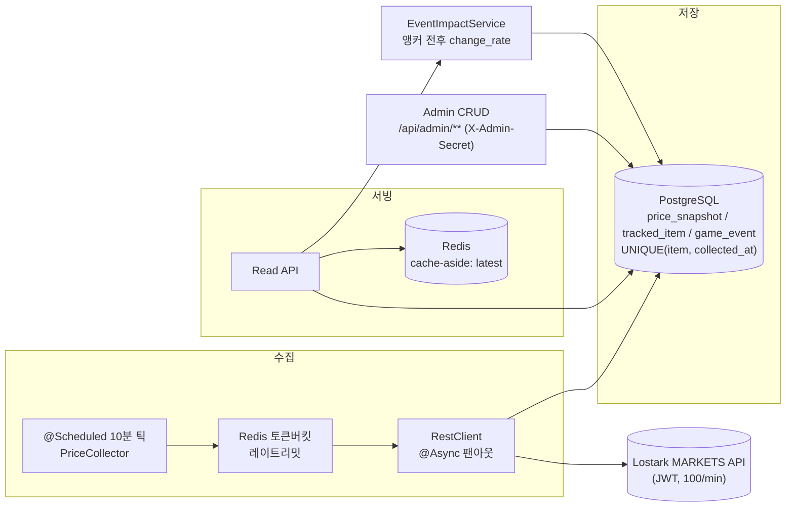

# 🎮 로스트아크 거래소 시세 트래커 (Lostark Market Tracker)

[](https://github.com/jongyeon2/lostark-market-tracker/actions/workflows/ci.yml)


> 로스트아크 거래소 시세를 10분마다 자동으로 모아 쌓고, 차트로 보여주는 웹 서비스입니다.
> 소재는 게임이지만 구조는 주식·코인 시세 수집 파이프라인과 같습니다.

### 🔗 라이브 데모 → **[loaket.kr](https://loaket.kr)**


---

## 이런 서비스예요

- 거래소 시세는 하루에도 계속 바뀌는데, 사람이 계속 지켜볼 수는 없습니다.
- 그래서 **10분마다 자동으로 시세를 모아** 쌓아두고, 다음을 보여줍니다.
  - 품목별 가격 흐름 차트
  - 게임 이벤트 무렵에 가격이 얼마나 오르내렸는지
  - 아바타·모험의 서 실시간 시세 조회

**왜 만들었나**

- 저는 로스트아크 유저이자 신입 백엔드 개발자입니다.
- 좋아하는 게임을 소재로, **외부 API에서 데이터를 빠짐없이 모아 저장하고 안정적으로 서빙하는 파이프라인**을 직접 설계했습니다.
- 도메인만 게임이고, 구조는 금융 시세 파이프라인과 같습니다.

> ⚠️ **이벤트가 가격을 움직였다고 말하지는 않습니다.**
> 이벤트 무렵에 가격이 이만큼 변했다는 사실만 보여줍니다.
> 그 시간대에 쌓인 시세가 없으면 숫자를 만들어내지 않고 "데이터 부족"이라고 씁니다.

---

## 직접 보기

**🔗 [loaket.kr](https://loaket.kr)** — 설치 없이 바로 볼 수 있습니다.

| 화면 | 무엇을 보여주나 | 바로가기 |
|------|----------------|----------|
| **대시보드** | 관심 품목 시세 + 이벤트 영향 + 로아 소식 | [열기](https://loaket.kr/dashboard) |
| **품목 타임라인** | 시세 라인 차트 + 기간 선택 + 이벤트 마커 | [열기](https://loaket.kr/timeline) |
| **아바타** | 직업별 아바타 실시간 시세 | [열기](https://loaket.kr/avatar) |
| **모험의 서** | 대륙별 수집품 실시간 시세 | [열기](https://loaket.kr/adventure) |

| 대시보드 | 이벤트 영향 |
|:---:|:---:|
|  |  |

<sub>※ 이벤트 영향은 관리자가 이벤트를 등록하면 채워집니다. 데이터가 부족하면 위처럼 빈 상태로 둡니다.</sub>

---

## 기술 스택

| 영역 | 사용 기술 |
|------|-----------|
| **백엔드** | Java 21 · Spring Boot 3.4 · Spring Data JPA · Spring Security |
| **저장소** | PostgreSQL 16 (Flyway) · Redis 7 (캐시 + 레이트리밋) |
| **프론트** | React 19 · TypeScript · Vite · Tailwind CSS · Recharts · TanStack Query |
| **테스트** | JUnit 5 · Mockito · Testcontainers (로컬·CI 동일) |
| **배포** | Docker Compose · Caddy (자동 HTTPS) · Oracle Cloud VM |

<sub>MSA · Kafka · Spring Batch는 포트폴리오 범위상 의도적으로 제외했습니다.</sub>

---

## 어떻게 배포했나

- **VM 한 대**(Oracle Cloud Always Free)에 Docker Compose로 앱·PostgreSQL·Redis·Caddy를 함께 올립니다.
- **Caddy가 유일한 공개 진입점**입니다.
  - 자동 HTTPS(Let's Encrypt)
  - 정적 프론트 서빙 + `/api` 프록시 → 같은 출처라 CORS 불필요
  - DB·Redis·앱은 내부 네트워크에 격리
- **수집기는 24/7 상시 동작**합니다 (`@Scheduled`).
- **`main`에 푸시하면 자동 배포됩니다.**
  - 테스트 → 이미지 빌드(GHCR) → VM 접속(Tailscale) → 무중단 교체 → HTTPS 헬스체크
  - 문제가 생기면 이전 이미지로 즉시 롤백
- 배포·보안·장애 대응 절차는 [`docs/deploy/oracle-vm-runbook.md`](docs/deploy/oracle-vm-runbook.md)에 있습니다.

---

## 어떻게 만들었나 (AI 협업)

**Claude Code + GSD 스펙 주도 워크플로우**로 만들었습니다. 다만 "AI가 알아서" 만든 결과물은 아닙니다.

- 아키텍처·데이터 모델·트레이드오프는 **제가 결정**하고 근거를 문서로 남겼습니다.
- 모든 변경은 **계획 → 실행 → 검증**을 거쳐 원자적 커밋으로 남습니다.
- Testcontainers 통합 테스트로 검증합니다.
- 그래서 이 저장소의 코드는 **왜 그렇게 했는지 설명할 수 있습니다**.

> AI는 속도를 높이는 도구였고, **설계 판단과 책임은 제가 집니다.**

---

<details>
<summary>📦 <b>엔지니어링 상세 펼치기</b> — 로컬 실행 · 아키텍처 · 설계 결정 · API · 프로젝트 구조</summary>

<br/>

### 로컬 실행

**필요한 것:** JDK 21, Docker *(프론트까지 보려면 Node.js)*

```bash
# 1) 인프라 기동 (Postgres 16 + Redis 7)
cp .env.example .env
docker compose up -d

# 2) 앱 실행 — seed 프로파일: 합성 데이터, API 키 불필요
./gradlew bootRun --args='--spring.profiles.active=seed'

# 3) 헤드라인 기능 호출
curl "http://localhost:8080/api/items/1/event-impact?window=24"
```

- **프로파일 2개**
  - `seed` — 합성 데이터. API 키 없이 바로 재현 (리뷰용)
  - `dev` — `.env`의 `LOSTARK_API_KEY`로 실제 거래소 API 호출. 라이브 배포와 같은 성격
- 관리자 콘솔(`/admin`)은 `.env`의 `ADMIN_API_SECRET`이 필요합니다.
  - 비어 있으면 `/api/admin/**`는 전부 401로 막습니다 (설정을 빠뜨리면 열리는 게 아니라 잠깁니다)
- 전체 테스트: `./gradlew build` (CI가 같은 명령을 실행합니다)
- 프론트: `cd frontend && npm install && npm run dev` → http://localhost:5173

### 아키텍처 — collect → store → serve → correlate



- **수집** — 10분마다 관심 품목 49종을 호출량 제한 안에서 한꺼번에 가져옵니다.
- **저장** — 같은 시각의 데이터는 두 번 저장되지 않게 막아, 재시작이나 중복 호출에도 기록이 어긋나지 않습니다.
- **서빙** — 최신가는 Redis에 잠깐 담아두고 내보냅니다.
- **맞춰보기** — 등록된 이벤트 시각을 기준으로 그 전후 시세를 찾아 변화율을 냅니다.

### 설계 결정 (정직한 "왜")

- **왜 Redis를 썼나**
  - 자주 읽히는 최신가를 잠깐 담아두고, 외부 API 호출 횟수를 세는 데 씁니다.
  - 솔직히 지금 규모(49종)면 DB만으로도 충분합니다.
  - 다만 호출 횟수는 앱을 재시작해도 이어져야 해서, DB보다 Redis가 맞다고 봤습니다.
- **왜 호출 횟수를 직접 세나**
  - 외부 API가 키 하나당 분당 100회까지만 받아줍니다.
  - 넘기면 수집이 통째로 막히기 때문에, 넘기기 전에 스스로 멈추게 했습니다.
- **먼저 굴러가게, 그다음 튼튼하게**
  - 1주차엔 제한·캐시 없이 "수집 → 저장 → 조회"만 되는 뼈대를 세웠습니다.
  - 그게 돌아가는 걸 확인한 뒤 토큰버킷·비동기 처리·캐시·범위 쿼리를 하나씩 얹었습니다.
- **이벤트가 원인이라고 말하지 않습니다**
  - 보여주는 건 "이벤트 무렵 가격이 이만큼 변했다"는 사실뿐입니다.
  - 그 시간대에 쌓인 시세가 없거나 너무 오래됐으면 계산하지 않고 "데이터 부족"으로 응답합니다.
  - 숫자가 비어 보이더라도 지어내는 것보다 낫다고 봤습니다.
- **아이콘과 배지**
  - 품목 아이콘·역할 배지(딜러/서포터/재료)는 API가 준 값을 DB에 저장해두고 그대로 내려줍니다.
  - 아이콘 서버가 막히면 같은 크기의 글리프로 대신해, 화면이 밀리지 않습니다.

### API 예시 — event-impact (헤드라인)

이벤트 직전 가격과 직후 가격을 하나씩 골라 `변화율 = 직후 / 직전 − 1`을 계산합니다.
양쪽 다 이벤트에서 30분 안쪽일 때만 `ok`이고, 하나라도 없거나 오래됐으면 `insufficient_data`입니다.

```bash
curl "http://localhost:8080/api/items/1/event-impact?window=24&sort=occurred_desc&limit=50"
```

```json
{
  "itemId": 1, "window": 24, "totalCount": 12,
  "events": [{
    "eventType": "LOA_ON", "title": "로아ON 쇼케이스",
    "occurredAt": "2026-06-22T15:05:00Z",
    "status": "ok", "prePrice": 1850, "postPrice": 2120, "changeRate": 0.1459
  }]
}
```

| 메서드 | 경로 | 설명 |
|--------|------|------|
| GET | `/api/items` | 관심 품목 목록 |
| GET | `/api/items/{id}/prices?from=&to=` | 기간별 시세 (범위가 넓으면 알아서 솎아서 내려줍니다) |
| GET | `/api/items/{id}/latest` | 최신가 (Redis 캐시) |
| GET | `/api/items/{id}/event-impact` | 이벤트 전후 변화율 (종류·정렬·개수 필터) |
| GET | `/api/gems` | 보석 현재가 |
| GET | `/api/market/avatar`, `/api/market/adventure` | 아바타·모험의 서 실시간 조회 |
| GET | `/api/news`, `/api/coupons` | 로아 공식 소식 · 쿠폰 |
| GET | `/api/health/collection` | 수집이 잘 돌고 있는지 확인 |
| POST·PUT·DELETE | `/api/admin/**` | 품목·이벤트 CRUD (X-Admin-Secret) |

- 시각은 전부 UTC ISO-8601입니다.
- 4xx는 `{timestamp, status, error, message}` 하나의 계약을 따릅니다.

### 프로젝트 구조

```
src/main/java/com/lostark/tracker/
├── collect/     # 수집 — PriceCollector(@Scheduled), @Async 팬아웃
├── ratelimit/   # 외부 API 호출량 제한
├── cache/       # 최신가 캐시
├── read/        # 읽기 — WindowQuery · Downsample · LatestPrice · EventImpact
├── market/      # 아바타·모험의 서 실시간 조회 (저장 안 함)
├── gem/         # 보석 현재가 + 시간당 기록
├── news/        # 로아 공식 소식 주기 수집
├── domain/      # 엔티티
├── web/         # 컨트롤러 + DTO + 전역 에러 핸들러
├── security/    # 관리자 인증 필터 (미설정 시 잠김)
└── seed/        # seed 프로파일 합성 데이터
frontend/        # React 19 + Vite (4화면, 다크모드)
docs/deploy/     # Oracle VM 배포 런북
.planning/       # 단계별 계획·결정 기록 (GSD)
```

### 스코프 / 한계

- **데이터 소스** — 거래소(MARKETS)가 중심입니다. 보석은 경매장에서 별도로 읽습니다.
- **저장 범위** — 관심 품목 49종만 기록으로 쌓습니다. 아바타·모험의 서는 저장하지 않고 그때그때 조회합니다.
- **서버 한 대** — VM 한 대로 상시 운영합니다. 여러 대로 늘리는 건 다음 버전입니다.
  - 앱이 내려가 있던 구간은 숨기지 않고 "데이터 부족"으로 드러냅니다.
- **데이터 보존** — 모은 기록을 지우지 않고 그대로 둡니다. 오래된 데이터를 요약해 줄이는 건 다음 버전입니다.

</details>

---

## 👤 개발자

- **개발** — jongyeon ([@jongyeon2](https://github.com/jongyeon2)), 단일 개발자
- **기간** — 2026.06 ~ 2026.07 (약 1개월)
- **유형** — 신입 백엔드 포트폴리오. 도메인은 게임, 구조는 금융 시세 파이프라인
- **저장소** — [github.com/jongyeon2/lostark-market-tracker](https://github.com/jongyeon2/lostark-market-tracker)
